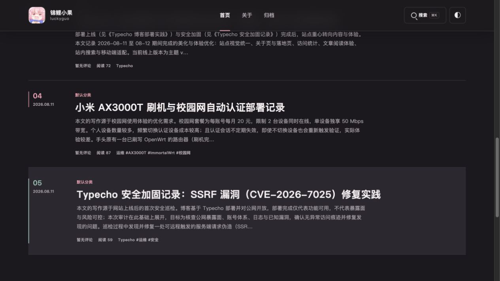
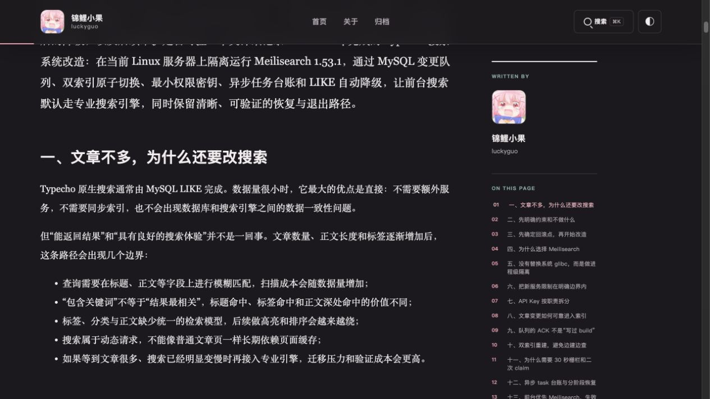

# Luckyguo Typecho Suite

English | [简体中文](README.zh-CN.md)

Reusable Typecho components developed for the Luckyguo site. This repository keeps the theme, related plugins, and the Typecho 1.3.0 SSRF hardening patch in one versioned bundle because the components share theme state, database conventions, and deployment assumptions.

## Screenshots







## Component inventory

- `plugins/LuckyguoAdmin`: shared light/dark theme for the Typecho administrator.
- `plugins/LuckyguoSearch`: Meilisearch-backed search with a database fallback and rebuild queue.
- `plugins/Monitor`: read-only monitoring dashboard for site and server metrics.
- `plugins/Sitemap`: public content sitemap route. The upstream MIT license is retained in the plugin directory.
- `themes/luckyguo`: the Luckyguo Typecho theme and its static assets.
- `patches/typecho-1.3.0-ssrf-hardening.patch`: hardening for Typecho 1.3.0 pingback and host validation.

## Scope and requirements

The verified baseline is Typecho `1.3.0`, PHP `7.4+` with `curl`, MySQL `8.0+`, and Typecho's `Mysqli` adapter. `LuckyguoSearch` depends on `Mysqli`; it cannot be copied unchanged to SQLite, PostgreSQL, or PDO adapters. The theme's counters also require MySQL `ON DUPLICATE KEY UPDATE` semantics.

This repository does not contain the Typecho core, `config.inc.php`, real domains, Meilisearch keys, database dumps, uploads, cache directories, server keys, or backup credentials. Keep each of those outside Git.

Before a first deployment, back up the database, `config.inc.php`, `usr/plugins/`, `usr/themes/`, and `usr/uploads/`. Record the Typecho/PHP versions, table prefix, and enabled plugins. Use a test copy or maintenance window rather than applying every component to a live site at once.

## Minimal installation

The examples use `/var/www/typecho` as the Typecho root. Replace it with your own location.

```sh
export TYPECHO_ROOT=/var/www/typecho
git clone https://github.com/jinlio/luckyguo-typecho-suite.git /tmp/luckyguo-typecho-suite
rsync -a /tmp/luckyguo-typecho-suite/plugins/ "$TYPECHO_ROOT/usr/plugins/"
rsync -a /tmp/luckyguo-typecho-suite/themes/luckyguo/ "$TYPECHO_ROOT/usr/themes/luckyguo/"
```

Enable the required plugins in **Dashboard -> Plugins** and select `luckyguo` in **Dashboard -> Appearance**. For the smallest safe rollout, install Typecho first, then the theme and Sitemap, validate ordinary frontend routes, RSS, comments, uploads, and `/sitemap.xml`, and only then add statistics, search, monitoring, and the SSRF patch.

After every component change, check anonymous pages, authenticated administration, and application logs. A successful service restart is not sufficient validation.

## Theme configuration and statistics

Set the biography, accent color, homepage URL, and Gitea URL from the theme settings. The site name, avatar text, and theme-cookie domain in `themes/luckyguo/header.php` are site-specific. If the blog is not under `*.luckyguo.dpdns.org`, replace that cookie `Domain` with a parent domain you control or remove it to make the preference host-only.

The visual layer can be reused independently. The statistics layer records per-post views, daily page views, and daily unique visitors. Views and page views are written to random buckets and read through `SUM()` to reduce hot-row lock contention. Unique visitors use a date-and-client-IP deduplication rule, so review privacy, retention, and legal obligations before adopting it.

Create the required tables before enabling statistics. The SQL uses the default `typecho_` prefix; replace it consistently if `config.inc.php` uses another prefix.

```sql
CREATE TABLE typecho_luckyguo_visits (
  vday DATE NOT NULL,
  bucket TINYINT UNSIGNED NOT NULL,
  pv BIGINT UNSIGNED NOT NULL DEFAULT 0,
  PRIMARY KEY (vday, bucket)
) ENGINE=InnoDB DEFAULT CHARSET=utf8mb4;

CREATE TABLE typecho_luckyguo_views (
  cid INT UNSIGNED NOT NULL,
  bucket TINYINT UNSIGNED NOT NULL,
  views BIGINT UNSIGNED NOT NULL DEFAULT 0,
  PRIMARY KEY (cid, bucket)
) ENGINE=InnoDB DEFAULT CHARSET=utf8mb4;

CREATE TABLE typecho_luckyguo_visitors (
  vday DATE NOT NULL,
  vip VARCHAR(64) NOT NULL,
  ua VARCHAR(250) NOT NULL,
  first_seen DATETIME NOT NULL,
  last_seen DATETIME NOT NULL,
  PRIMARY KEY (vday, vip)
) ENGINE=InnoDB DEFAULT CHARSET=utf8mb4;

CREATE TABLE typecho_luckyguo_visitors_daily (
  vday DATE NOT NULL,
  uv INT UNSIGNED NOT NULL DEFAULT 0,
  PRIMARY KEY (vday)
) ENGINE=InnoDB DEFAULT CHARSET=utf8mb4;
```

If statistics are not needed, remove the recording calls or use only the visual portion of the theme. Do not leave production code silently failing against missing tables.

## Plugin setup

### LuckyguoAdmin

Copy it to `usr/plugins/LuckyguoAdmin/` and enable it. The plugin injects a dark/light administrative skin through `admin/header.php` and shares the frontend `luckyguo-theme` cookie/localStorage preference. Change the theme, refresh an administrator page, and verify the setting persists; disabling the plugin should restore Typecho's default administrative UI.

### Sitemap

Enabling the plugin registers `/sitemap.xml`. The administrator can include posts, pages, categories, and tags and choose an update frequency. Add a matching line to the site-root `robots.txt`:

```text
Sitemap: https://blog.example.com/sitemap.xml
```

The generator excludes password-protected content, empty categories, and empty tags. It caps a single Sitemap at 50,000 URLs; move to a Sitemap Index before the site reaches that scale.

```sh
curl -fsS https://blog.example.com/sitemap.xml | head
curl -sI https://blog.example.com/sitemap.xml
```

### Monitor

`Monitor` is not a general-purpose monitoring product. It reads a local JSON status file and a separate monitoring database for Typecho administrators only. Before enabling it, edit `panel.php` so the status-file path, environment-file path, database name, and CPU-core count match your own collector.

Use a read-only database account, restrict the environment file to root and the required service, keep the status JSON outside the web root, and never expose the panel to unauthenticated users. Do not enable the plugin if a matching collector has not been deployed.

## Search deployment

`LuckyguoSearch` uses Meilisearch for primary search and falls back to a parameterized MySQL `LIKE` query when Meilisearch is unavailable. Full rebuilds follow **build -> compensate mutations -> fence -> swap indexes**, which prevents frontend reads from a partially built index.

Do not expose Meilisearch directly to the public Internet. Bind it to loopback or a private network and use different capabilities for search, live writes, and rebuild tasks. Keep the configuration files outside the web root.

`/etc/luckyguo-search-search.env`:

```ini
MEILI_URL=http://127.0.0.1:7700
SEARCH_KEY=replace-with-search-key
# Optional. Without WRITE_KEY, changes remain queued until a full rebuild.
WRITE_KEY=replace-with-write-key
MEILI_INDEX_LIVE=posts_live
```

`/etc/luckyguo-search.env`:

```ini
MEILI_URL=http://127.0.0.1:7700
REBUILD_KEY=replace-with-rebuild-key
TASK_KEY=replace-with-task-key
MEILI_INDEX_LIVE=posts_live
MEILI_INDEX_BUILD=posts_build
REBUILD_FENCE_TIMEOUT=30
```

Adapt the group to the PHP-FPM/rebuild user, then restrict access:

```sh
sudo chown root:nginx /etc/luckyguo-search*.env
sudo chmod 640 /etc/luckyguo-search*.env
```

Initialize the queue, metadata, and task-ledger tables before activating the plugin. These definitions again assume the `typecho_` prefix:

```sql
CREATE TABLE typecho_luckyguo_changequeue (
  id BIGINT UNSIGNED NOT NULL AUTO_INCREMENT,
  cid INT UNSIGNED NOT NULL,
  op VARCHAR(8) NOT NULL,
  created_at DATETIME(6) NOT NULL,
  processed_at DATETIME(6) NULL,
  rebuild_batch_id VARCHAR(32) NULL,
  PRIMARY KEY (id),
  KEY idx_cid (cid), KEY idx_processed (processed_at), KEY idx_batch (rebuild_batch_id)
) ENGINE=InnoDB DEFAULT CHARSET=utf8mb4;

CREATE TABLE typecho_luckyguo_searchmeta (
  id INT UNSIGNED NOT NULL,
  search_index_version VARCHAR(32) NOT NULL,
  rebuild_batch_id VARCHAR(32) NULL,
  build_start DATETIME(6) NULL, build_end DATETIME(6) NULL,
  document_count INT UNSIGNED NULL, swap_task_uid BIGINT UNSIGNED NULL,
  rebuild_state ENUM('UNLOCKED','LOCKED','RECOVERY') NOT NULL DEFAULT 'UNLOCKED',
  rebuild_phase ENUM('IDLE','BUILD','FENCE','SWAP','POST_SWAP','ROLLBACK') NOT NULL DEFAULT 'IDLE',
  created_at DATETIME(6) NOT NULL,
  PRIMARY KEY (id)
) ENGINE=InnoDB DEFAULT CHARSET=utf8mb4;

CREATE TABLE typecho_luckyguo_rebuildtask (
  id BIGINT UNSIGNED NOT NULL AUTO_INCREMENT,
  batch_id VARCHAR(32) NOT NULL, task_uid BIGINT UNSIGNED NULL,
  operation VARCHAR(16) NOT NULL, index_uid VARCHAR(128) NOT NULL,
  status VARCHAR(16) NOT NULL, submitted_at DATETIME(6) NOT NULL,
  finished_at DATETIME(6) NULL,
  PRIMARY KEY (id), UNIQUE KEY uq_task_uid (task_uid),
  KEY idx_batch_status (batch_id, status), KEY idx_index_time (index_uid, submitted_at)
) ENGINE=InnoDB DEFAULT CHARSET=utf8mb4;

INSERT INTO typecho_luckyguo_searchmeta
  (id, search_index_version, rebuild_state, rebuild_phase, created_at)
VALUES (1, 'initial', 'UNLOCKED', 'IDLE', NOW(6))
ON DUPLICATE KEY UPDATE id = VALUES(id);
```

Prepare a single-instance scheduled rebuild entrypoint that loads Typecho `config.inc.php`, then `RuntimeConfig`, `MeiliClient`, `Indexer`, `RebuildStore`, and `RebuildService`, and calls `RebuildService::run()`. A systemd timer is preferred to overlapping cron jobs. It should keep a lock file in a dedicated runtime directory, retain stderr, start after MySQL/Meilisearch, preserve the queue on failure, and eventually return the phase to `IDLE`.

On first deployment, publish a unique-term post, check that the queue receives it, run a full rebuild, and confirm `posts_live` contains the expected document count. Then modify, privatize, and delete posts to verify index consistency. Stop Meilisearch briefly to verify the frontend falls back to `LIKE`, then restore it and rebuild. If a rebuild is interrupted, do not clear `posts_live` or the queue; inspect `searchmeta`, logs, and Meilisearch task state, then rerun the same entrypoint so recovery logic can finish outstanding work.

## Retention and backup

Run a daily retention task that merges prior-day PV buckets into bucket 0 and aggregates visitor details into per-day UV before deleting records older than the chosen retention period. Use a named database lock, perform summary and deletion in one transaction, and prove that retries cannot double-count. Keep database, application, and scheduler time zones aligned.

Before a 180-day cleanup, inspect the target rows in a backup or test database:

```sql
SELECT vday, COUNT(*) AS uv
FROM typecho_luckyguo_visitors
WHERE vday < CURDATE() - INTERVAL 180 DAY
GROUP BY vday
ORDER BY vday;
```

Separate code release from data backup. Git and repository mirrors preserve code; database backups preserve blog data. If Gitea repositories are mirrored to GitHub, separate Gitea repository-data backups are not needed for code preservation, but Gitea configuration, keys, and non-reproducible runtime settings still require controlled backups.

```sh
mysqldump --single-transaction --routines --events --triggers \
  --default-character-set=utf8mb4 typecho | gzip > typecho-$(date +%F-%H%M%S).sql.gz
```

Before restoring any backup, make a new backup of the current state. A full database import overwrites later posts, comments, settings, and statistics. For theme or plugin failures, prefer a Git rollback or temporarily disabling the plugin over restoring the whole database.

## SSRF patch

Apply the patch only to a matching, clean Typecho 1.3.0 checkout:

```sh
cd /var/www/typecho
git apply --check /path/to/typecho-1.3.0-ssrf-hardening.patch
git apply /path/to/typecho-1.3.0-ssrf-hardening.patch
```

Rollback it with:

```sh
git apply --reverse /path/to/typecho-1.3.0-ssrf-hardening.patch
```

The patch rejects loopback, private, link-local, CGNAT, reserved, multicast, and unsafe IPv6 literal targets in the affected Pingback and Trackback outbound flows. It also validates DNS-resolved addresses before requesting them.

Important limitation: this is not complete DNS-rebinding protection. The hostname is checked during preflight but the HTTP client can resolve it again when connecting, and current hostname resolution mainly covers A records. A stronger solution must inspect A and AAAA responses, connect to the validated address, and retain correct TLS SNI/Host validation. Do not claim that the patch completely prevents DNS rebinding.

Test a normal public HTTP/HTTPS endpoint and isolated rejection cases for `localhost`, loopback, RFC1918 ranges, `100.64.0.0/10`, link-local ranges, `::1`, `fc00::/7`, `fe80::/10`, and multicast. Never use real production internal services as SSRF test targets.

## Release validation and troubleshooting

Use this release order: pull a specific commit, inspect `git diff`, back up the database/configuration, sync code, run migrations and syntax checks, reload PHP-FPM/Nginx, then test anonymous pages, authenticated administration, search, Sitemap, and logs.

```sh
php -l /var/www/typecho/usr/themes/luckyguo/functions.php
php -l /var/www/typecho/usr/plugins/Sitemap/Plugin.php
nginx -t
curl -fsSI https://blog.example.com/
curl -fsS https://blog.example.com/sitemap.xml | head
```

The repository omits the full Typecho core and real configuration, so it cannot run end-to-end alone. Execute validation in a matching Typecho environment.

| Symptom | Check first |
| --- | --- |
| Statistics always show 0 | Required tables, table prefix, and PHP error logs |
| Search always falls back to LIKE | Meilisearch reachability, `SEARCH_KEY`, and PHP curl |
| Published posts are not indexed | Mutation queue, `WRITE_KEY`, and rebuild timer/service |
| Rebuild never completes | `searchmeta` phase/state, lock file, task logs, and Meilisearch task status |
| Admin skin is absent | Plugin activation, static asset path, and browser cache |
| `/sitemap.xml` returns 404 | Sitemap activation and route/permalink cache |
| Patch does not apply | Typecho revision/local changes; compare target files instead of forcing it |

## Related Write-Ups

- [Typecho blog deployment: architecture, configuration, and release notes](https://blog.luckyguo.dpdns.org/archives/6/)
- [Typecho SSRF hardening: CVE-2026-7025 remediation](https://blog.luckyguo.dpdns.org/archives/8/)
- [Theme and reading-experience improvements](https://blog.luckyguo.dpdns.org/archives/9/)
- [Statistics concurrency: sharded counters, caching, and retention](https://blog.luckyguo.dpdns.org/archives/10/)
- [Search architecture: Meilisearch, dual indexes, and graceful fallback](https://blog.luckyguo.dpdns.org/archives/11/)

## License

The bundle is distributed under GPL-2.0-or-later. Third-party notices and the original MIT license for the Sitemap plugin are kept alongside their respective sources.
