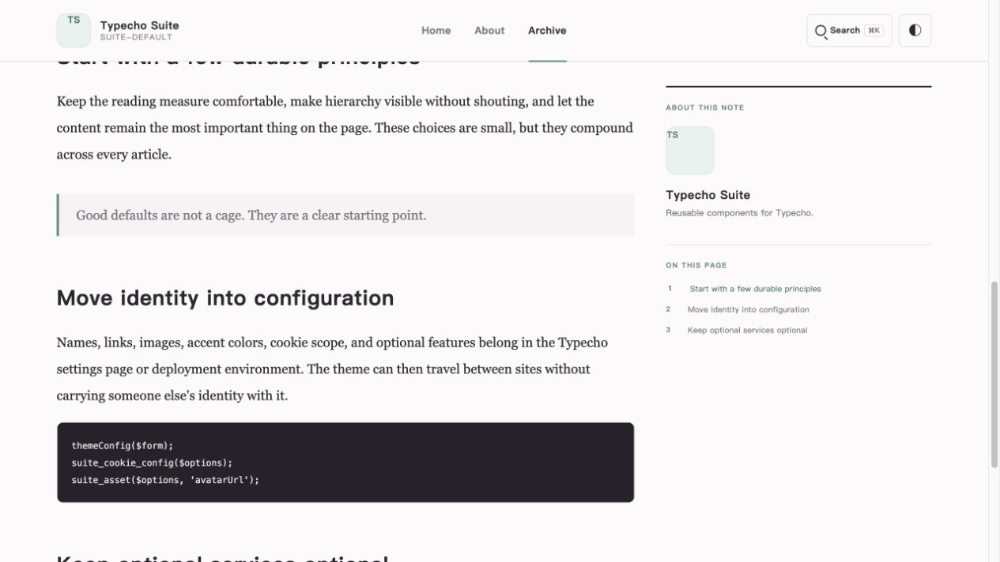
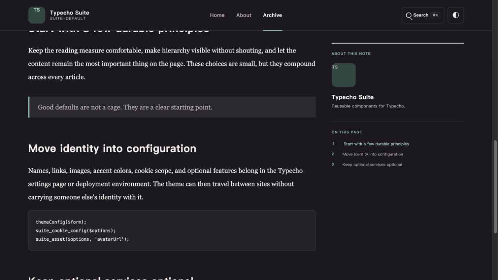
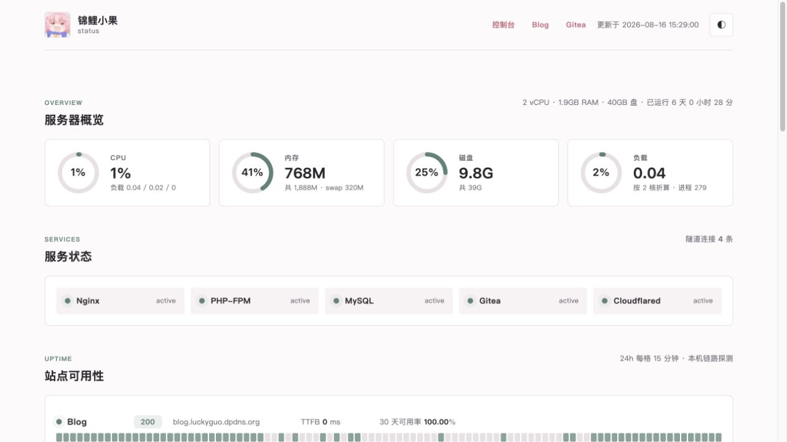
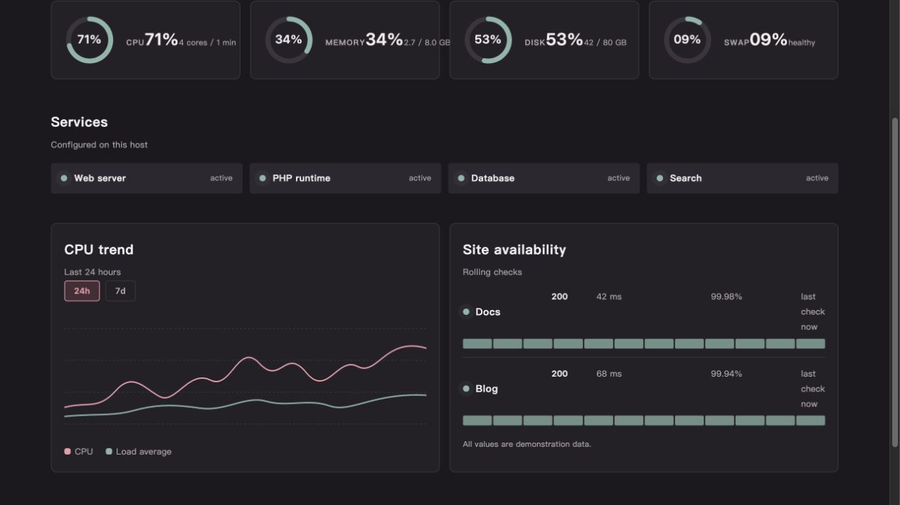

# Typecho Suite

[](#typecho-suite)

> **[English](README.md)** · **[简体中文](README.zh-CN.md)**

一组可复用、可配置的 Typecho 主题和插件，适合个人博客、小型内容站点及自托管部署。它包含一套中性响应式主题、可选的后台皮肤、站点地图、Meilisearch 集成、只读监控面板、可选的匿名访问统计、部署脚本与 systemd 单元，以及一份独立的 Typecho 1.3.0 SSRF 加固补丁。

本仓库不包含任何个人域名、作者身份、生产数据库、上传文件、凭据、服务器密钥或完整 Typecho 核心代码。请在 Typecho 后台或站点根目录之外的文件中配置站点专属值。

## 目录

[](#目录)

- [包含内容](#包含内容)
- [截图展示](#截图展示)
- [运行要求](#运行要求)
- [快速开始](#快速开始)
  - [0. 准备环境与备份](#0-准备环境与备份)
  - [1. 复制可复用文件](#1-复制可复用文件)
  - [2. 启用主题](#2-启用主题)
  - [3. 启用 SuiteAdmin（可选）](#3-启用-suiteadmin可选)
  - [4. 启用 Sitemap（可选）](#4-启用-sitemap可选)
  - [5. 启用 SuiteSearch（可选）](#5-启用-suitesearch可选)
  - [6. 启用 SuiteMonitor（可选）](#6-启用-suitemonitor可选)
  - [7. 可选：匿名访问统计](#7-可选匿名访问统计)
  - [8. 可选：Typecho 源码补丁](#8-可选typecho-源码补丁)
  - [9. 端到端验收](#9-端到端验收)
- [主题配置](#主题配置)
- [插件配置](#插件配置)
  - [SuiteAdmin](#suiteadmin)
  - [Sitemap](#sitemap)
  - [SuiteSearch](#suitesearch)
  - [SuiteMonitor](#suitemonitor)
- [升级、卸载和回滚](#升级卸载和回滚)
- [数据库、隐私与安全](#数据库隐私与安全)
- [校验](#校验)
- [许可证](#许可证)

## 包含内容

[](#包含内容)

| 路径 | 作用 | 必需 |
| --- | --- | --- |
| `themes/suite-default` | 响应式主题、深色模式、文章目录、代码块和品牌配置 | 无插件依赖 |
| `plugins/SuiteAdmin` | 可选 Typecho 后台浅色/深色皮肤，共享主题 Cookie | 否 |
| `plugins/Sitemap` | `/sitemap.xml` 站点地图、内容类型与更新频率 | 否 |
| `plugins/SuiteSearch` | Meilisearch 搜索、参数化 MySQL `LIKE` 降级和重建队列 | 否 |
| `plugins/SuiteMonitor` | 需管理员登录的只读监控面板（服务器、站点、流量、可选博客统计、可选 24 小时日志） | 否 |
| `deploy/create-suite-monitor.sql` | 监控数据库结构（原始表 + 小时/天汇总 + 日志事件） | 仅 SuiteMonitor |
| `deploy/create-monitor-rollups.sql` | 老版本监控库的迁移脚本（补 `swap_total`） | 仅历史库升级 |
| `deploy/create-suite-search.sql` | 搜索变更队列、搜索状态和重建任务表 | 仅在需要完整重建时 |
| `deploy/create-suite-stats.sql` | Typecho 库内的匿名统计表 | 仅启用统计时 |
| `deploy/monitor-collect.sh` | 每分钟执行的系统、站点和流量采集器 | SuiteMonitor |
| `deploy/monitor-log-collect.sh` | 每分钟执行的日志采集器（文件 + journald），写入 `log_events` | SuiteMonitor |
| `deploy/monitor-prune.sh` | 每日运行的原始表与汇总表保留清理任务 | SuiteMonitor |
| `deploy/monitor.cron` | `/etc/cron.d` 示例（`install-monitor.sh` 会写入等价文件） | 仅作参考 |
| `deploy/suite-monitor-config.php` | 后台设置导出器，由 cron 任务 `eval` 调用 | SuiteMonitor |
| `deploy/install-monitor.sh` | 安装 SuiteMonitor 运行文件与 cron 调度 | SuiteMonitor |
| `deploy/check-install.sh` | 只读的安装与运行诊断 | 强烈推荐 |
| `deploy/suite-search-rebuild.php` | 夜间完整重建 Meilisearch 索引的入口 | 仅在需要完整重建时 |
| `deploy/typecho-suite-search-rebuild.service` | 重建入口的 systemd service | 可选 |
| `deploy/typecho-suite-search-rebuild.timer` | 重建定时器（`OnCalendar=*-*-* 03:30:00`） | 可选 |
| `deploy/examples/*.env.example` | 旧版 env 模板（后台设置已是新默认） | 仅作参考 |
| `patches/typecho-1.3.0-personal-avatar.patch` | 在 Typecho 个人设置页加入头像地址和头像上传 | 可选，仅 Typecho 1.3.0 |
| `patches/typecho-1.3.0-ssrf-hardening.patch` | 增强 `Typecho\Common::safeUrl` 的 SSRF 防护（CVE-2026-7025） | 可选，仅 Typecho 1.3.0 |
| `tests/static-check.sh` | 校验 PHP、JS、Shell 并强制仓库洁净规则 | 发布前 |

## 截图展示

[](#截图展示)

以下截图使用公开版组件的中性演示内容生成；监控数值为模拟数据，不代表任何生产服务器。

### 主题首页

[](#主题首页)


### 文章阅读与右侧目录

[](#文章阅读与右侧目录)





### SuiteMonitor 后台资源监控

[](#suitemonitor-后台资源监控)





## 运行要求

[](#运行要求)

目标环境为 Typecho 1.3.0、PHP 7.4 及以上、MySQL 8.0 及以上（`Mysqli` 适配器），以及 Nginx 或 Apache。主题不依赖自定义数据表。SuiteSearch 需要 `Mysqli` 适配器才能在不可用时降级到 `LIKE` 搜索，并在不支持的适配器上显式拒绝。搜索变更队列表会被自动探测；不创建 `create-suite-search.sql` 时，搜索仍可使用 MySQL `LIKE`，Meilisearch 实时写入也保持可选。匿名统计表仅在主题的“启用访问统计”开启后才需要。Typecho 1.3.0 的 SSRF 与个人头像补丁都是可选的，必须对精确匹配的 Typecho 1.3.0 源码应用。

## 快速开始

[](#快速开始)

下面九个步骤覆盖主题和每一个可选插件。每一步都列出要复制的文件、要启用的功能、验证方法和回滚方式。不需要的功能可以直接跳过对应步骤。

### 0. 准备环境与备份

[](#0-准备环境与备份)

在运行 Typecho 的主机上安装：

- PHP 7.4 及以上，并启用 `mysqli` 与 `PDO` 扩展（监控的站点探测还需要 `curl`）。
- MySQL 8.0 及以上。MariaDB 10.5+ 配合 `Mysqli` 适配器也可以。
- Nginx 或 Apache，对外提供 Typecho 站点。
- 推荐但非必须：`bash`、`awk`、`sed`、`curl` 与 `mysql` 客户端（监控采集器会用到）。
- 可选：可被 PHP 进程访问的 Meilisearch 实例（1.x 或 2.x）。如果没有，SuiteSearch 会静默降级到 MySQL `LIKE`。

在动手之前先把现有数据备份好，确保步骤可以重复执行或回滚：

```sh
sudo cp /var/www/typecho/config.inc.php /var/www/typecho/config.inc.php.bak
sudo mysqldump typecho > /tmp/typecho-$(date +%Y%m%d).sql
sudo rsync -a /var/www/typecho/usr/ /tmp/typecho-usr-$(date +%Y%m%d)/
```

把 `/var/www/typecho` 替换成实际的 Typecho 根目录。下文步骤都基于这个路径；若不同，请相应修改 `TYPECHO_ROOT`。

### 1. 复制可复用文件

[](#1-复制可复用文件)

把仓库克隆到临时目录，只复制你打算启用的目录：

```sh
TYPECHO_ROOT=/var/www/typecho
git clone --depth 1 https://github.com/jinlio/luckyguo-typecho-suite.git /tmp/typecho-suite

# 主题始终需要
rsync -a /tmp/typecho-suite/themes/suite-default/   "$TYPECHO_ROOT/usr/themes/suite-default/"

# 下面四个按需复制
rsync -a /tmp/typecho-suite/plugins/SuiteAdmin/     "$TYPECHO_ROOT/usr/plugins/SuiteAdmin/"
rsync -a /tmp/typecho-suite/plugins/Sitemap/        "$TYPECHO_ROOT/usr/plugins/Sitemap/"
rsync -a /tmp/typecho-suite/plugins/SuiteSearch/    "$TYPECHO_ROOT/usr/plugins/SuiteSearch/"
rsync -a /tmp/typecho-suite/plugins/SuiteMonitor/  "$TYPECHO_ROOT/usr/plugins/SuiteMonitor/"
```

保留 `/tmp/typecho-suite` 目录，后续更新时可以直接重新 `rsync`。`deploy/` 下的脚本刻意不放在 Web 根目录里，而是安装在 `usr/` 之外，避免采集器进程继承 PHP-FPM 的权限。

**验证**：每个被复制的目录都能看到关键文件：

```sh
ls "$TYPECHO_ROOT/usr/themes/suite-default/functions.php"
ls "$TYPECHO_ROOT/usr/plugins/SuiteMonitor/panel.php"
```

### 2. 启用主题

[](#2-启用主题)

1. 登录 Typecho 后台 `/admin/`。
2. 进入 **控制台 → 外观 → suite-default → 启用**。
3. 打开主题设置页，按顺序填写身份与文案、资料与联系方式、头像地址、网站图标地址、Gravatar 地址、首页横幅/分享封面/文章封面地址、文章顶部封面显示开关、个人主页与代码仓库链接、强调色、主题 Cookie 名称与域名、默认主题模式、页面与正文宽度、阅读速度、站点起始时间，以及搜索入口、阅读进度、代码增强、页面动画、访问统计、首页附加模块、文章目录、评论 RSS、阅读信息、Gravatar 等开关。关于页技术栈卡片、正在做的事、写作方向、详细简介、联系邮箱和所有个人链接都可在此配置。每个字段都有占位说明，不需要的可以留空。
4. 保存。首次启用时，主题会从 Typecho 基本设置和首个管理员资料导入站点标题、站点描述、昵称、用户名、个人主页、个人简介和已保存的头像地址；已有设置不会被覆盖。

**验证**：访问首页和任意一篇文章。页头显示你填写的站点名称；切换深浅色后再次刷新页面，偏好应当保持。移动端模拟窗口（Chrome DevTools 即可）打开文章页，确认右侧目录和汉堡菜单正常显示。

### 3. 启用 SuiteAdmin（可选）

[](#3-启用-suiteadmin可选)

SuiteAdmin 让 Typecho 后台复用主题配色，并提供一个跟随前台 Cookie 的浅深色切换。

1. 进入 **控制台 → 插件 → SuiteAdmin → 启用**。
2. 打开插件设置，确认 `主题偏好 Cookie 名称` 与主题的“主题偏好 Cookie 名称”一致（默认 `suite-theme`）。`主题偏好 Cookie 域名` 留空表示仅当前主机生效；需要多个可信子域共享切换时再填写父域。
3. 选择后台默认主题模式（`跟随系统` / `默认浅色` / `默认深色`）。
4. 保存。

**验证**：刷新任意后台页面，点击右上角的主题切换按钮，配色立刻翻转并能跨刷新保持。前台打开任意页面，确认两端的 Cookie 值一致：

```sh
curl -sI "$TYPECHO_ROOT/../" | grep -i set-cookie
```

### 4. 启用 Sitemap（可选）

[](#4-启用-sitemap可选)

1. 进入 **控制台 → 插件 → Sitemap → 启用**。
2. 打开插件设置，勾选需要暴露的内容类型（`生成文章链接`、`生成独立页面链接`、`生成分类链接`、`生成标签链接`），并在 `更新频率` 中选择 `每天`、`每周` 或 `每月或更久`。
3. 保存。
4. 把站点地图地址加入 `robots.txt`：

   ```
   Sitemap: https://yourdomain.com/sitemap.xml
   ```

**验证**：站点地图路由已对外开放，返回标准 XML。密码保护的文章和空分类/空标签会自动跳过；单个文件最多 50,000 个 URL。

```sh
curl -fsS https://yourdomain.com/sitemap.xml | head
curl -fsS https://yourdomain.com/sitemap.xml | grep -c '<loc>'
```

如果通过 Nginx 反向代理，请确保请求原样转发到 Typecho（不要让 `rewrite` 规则吃掉 `sitemap.xml`）。

### 5. 启用 SuiteSearch（可选）

[](#5-启用-suitesearch可选)

决定是否需要完整重建队列。大多数博客只使用 Meilisearch + 实时写入即可，跳过队列表即可。

1. 如需启用变更队列和定时完整重建，先在 Typecho 数据库里创建队列表（若表前缀不是 `typecho_`，请替换后再执行）：

   ```sh
   mysql typecho < deploy/create-suite-search.sql
   ```

2. 进入 **控制台 → 插件 → SuiteSearch → 启用**。
3. 打开插件设置，按需填写：

   - `启用 Meilisearch 搜索`：关闭则强制只使用 MySQL `LIKE`。
   - `Meilisearch 地址`：`http://127.0.0.1:7700` 或你自己的远程地址；留空表示不使用 Meilisearch。
   - `搜索 API Key（只读）`：查询时必须。
   - `写入 API Key`：发布/保存/删除后实时写入时使用；不填会跳过直写。
   - `重建 API Key`：`suite-search-rebuild.php` 调用时使用。
   - `任务查询 API Key`：可选；留空时回退到重建 Key。
   - `在线索引名称`：默认 `posts_live`。
   - `构建索引名称`：默认 `posts_build`；仅在完整重建时使用，外部不要直接查询。
   - `重建切换超时（秒）`：最少 5 秒。
   - `实时同步`：发布/保存/删除时把变更推到队列或直写索引。
   - `降级策略`：Meilisearch 不可用时回退到 MySQL `LIKE`。

   密码框刻意保持空白；留空表示保留已存值；输入新值才会覆盖；勾选 `清除已保存的 API Key` 会清空所有已保存密钥。

4. 保存。

**验证**：在前台搜索框输入文章中出现过的关键词。若 Meilisearch 可达，结果来自 Meilisearch；否则来自 MySQL `LIKE`。在搜索过程中观察 PHP 错误日志确认没有警告：

```sh
sudo tail -n 50 /var/log/php-fpm/www-error.log
```

如需启用 systemd 夜间完整重建（仅在已经创建队列表的前提下）：

```sh
sudo cp deploy/typecho-suite-search-rebuild.service /etc/systemd/system/
sudo cp deploy/typecho-suite-search-rebuild.timer    /etc/systemd/system/
sudo cp deploy/suite-search-rebuild.php             /usr/local/bin/typecho-suite-search-rebuild
sudo chmod 0750 /usr/local/bin/typecho-suite-search-rebuild
sudo systemctl daemon-reload
sudo systemctl enable --now typecho-suite-search-rebuild.timer
systemctl list-timers | grep typecho-suite
```

重建脚本优先使用后台设置；旧版 `deploy/examples/search-rebuild.env.example` 仅作兼容回退。

### 6. 启用 SuiteMonitor（可选）

[](#6-启用-suitemonitor可选)

SuiteMonitor 读取独立的监控数据库。采集器和 cron 调度都安装在 Typecho Web 根目录之外。

#### 6.1 创建监控数据库

[](#61-创建监控数据库)

从仓库根目录运行，这样 SQL 文件的相对路径才能解析：

```sh
sudo mysql <<'SQL'
CREATE DATABASE monitor DEFAULT CHARACTER SET utf8mb4 COLLATE utf8mb4_unicode_ci;
-- 后台面板使用的只读账号
CREATE USER 'monitor_ro'@'127.0.0.1' IDENTIFIED BY 'change-me-ro';
GRANT SELECT ON monitor.* TO 'monitor_ro'@'127.0.0.1';
-- 采集器 cron 使用的读写账号
CREATE USER 'monitor_rw'@'127.0.0.1' IDENTIFIED BY 'change-me-rw';
GRANT SELECT, INSERT, UPDATE, DELETE ON monitor.* TO 'monitor_rw'@'127.0.0.1';
FLUSH PRIVILEGES;
SQL

# 导入表结构（路径相对于仓库根目录）
mysql monitor < deploy/create-suite-monitor.sql
```

如果是从更早的监控库升级，先执行一次 `deploy/create-monitor-rollups.sql` 再部署新采集器。新安装只需要 `create-suite-monitor.sql`。

#### 6.2 安装采集器与 cron

[](#62-安装采集器与-cron)

```sh
sudo TYPECHO_ROOT=/var/www/typecho deploy/install-monitor.sh
```

脚本会把 `monitor-collect.sh`、`monitor-log-collect.sh`、`monitor-prune.sh` 和 `suite-monitor-config.php` 复制到 `/usr/local/sbin` 和 `/usr/local/libexec`，然后写入 `/etc/cron.d/typecho-suite-monitor`，包含三条规则：

- 每分钟：采集器 + 日志采集器
- 每天 04:17：保留清理

采集器必须以 `root` 运行，因为它要读取 `/proc`、查询 systemd 单元状态、并 tail 受保护的日志文件。如果担心权限，请在插件设置页收紧要监控的 systemd 服务和日志路径。

#### 6.3 启用并配置插件

[](#63-启用并配置插件)

1. 进入 **控制台 → 插件 → SuiteMonitor → 启用**。激活是幂等的：会先移除所有遗留面板注册（`Monitor`、`LuckyguoMonitor`、`LuckyguoStats`），再注册 `SuiteMonitor/panel.php`。
2. 打开插件设置页，按下面的顺序逐项填写：

   **品牌（顶部三栏）**
   - `监控品牌名称` / `监控品牌标识` / `监控品牌头像地址`：三项全部留空时，自动继承当前主题的站点名称、作者标识和头像地址；若想与前台区分，可显式填写。

   **文件路径**
   - `状态 JSON 路径`：默认 `/var/lib/typecho-suite/monitor/status.json`（采集器写入、面板读取）。
   - `旧版监控环境文件路径`：默认 `/etc/typecho-suite/monitor.env`，新采集器无需修改。
   - `采集器状态目录`：默认 `/var/lib/typecho-suite/monitor`。
   - `Nginx 访问日志路径`：指向真实的访问日志，例如 `/var/log/nginx/access.log`。

   **数据库**
   - `监控数据库名称` / `主机` / `端口`：对应 6.1 中创建的库。
   - `监控数据库 DSN`：默认 `mysql:host=127.0.0.1;dbname=monitor;charset=utf8mb4`，后台面板只读连接使用。
   - `采集器写入数据库用户名` / `密码`：`monitor_rw` 账号。密码框刻意留空表示保留已存值。
   - `监控面板只读数据库用户名` / `密码`：`monitor_ro` 账号。
   - `清除已保存的数据库密码`：保存前勾选可同时清空两个密码字段。
   - `Typecho 数据库名` / `表前缀`：仅在启用 `博客访问统计` 时需要。

   **系统与探测**
   - `CPU 核数`：默认 `1`，请改为宿主机的实际核数，让负载指标有意义。
   - `需要监测的 systemd 服务`：空格分隔，例如 `nginx php-fpm mysqld`。“服务状态”卡片会显示这里的服务。
   - `站点探测目标`：空格分隔的 `key=host:port`，例如 `blog=blog.example.com:80 docs=docs.example.com:80`。采集器会通过本机回环探测并记录 HTTP 状态码与 TTFB。
   - `状态文件 owner` / `group` / `权限`：可选；PHP worker 需要直接读取快照时，把 group 设为 Web 服务器用户组（如 `www-data`）。
   - `原始监控数据保留天数` / `汇总监控数据保留天数`：默认 `45` / `400`，由 `monitor-prune.sh` 使用。
   - `监测目标显示名称`：一行一条 `key=名称`，例如 `blog=主站`。
   - `监测目标链接`：一行一条 `key=URL`，例如 `blog=https://blog.example.com`。

   **导航、页脚与日志**
   - `监控顶部导航`：一行一条 `key=名称|目标`。目标可以是 `admin`、`site`、已配置的站点 key，或 `https://...` URL。默认是 `控制台|admin`、`首页|site`、`落地页|landing`；目标未配置时会自动隐藏。
   - `页脚代码仓库地址` / `页脚代码仓库名称`：面板页脚链接的地址和文案。
   - `页脚链接开关`：勾选后才会真正渲染页脚链接（默认隐藏）。
   - `异常日志文件来源`：一行一条 `source=绝对路径`，例如 `nginx=/var/log/nginx/error.log`。采集器会增量 tail 这些文件，把 warning 及以上级别写入 `log_events`。
   - `异常日志 journald 服务`：空格分隔的 systemd 单元名，例如 `sshd nginx php-fpm mysqld`。采集器会通过 `journalctl --since <上次运行>` 读取这些单元。
   - `服务显示名称`：一行一条 `服务名=显示名称`。

   **显示与主题**
   - `主题偏好 Cookie 名称` / `Cookie 域名`：与主题和 SuiteAdmin 保持一致时，三处切换会联动。
   - `博客访问统计`：勾选后才会渲染博客统计面板；前提是已经执行 `deploy/create-suite-stats.sql`（见第 7 步），且 `monitor_ro` 账号对 Typecho 库拥有 `SELECT`。
   - `监控面板默认时间范围`：`24 小时` / `7 天` / `30 天` / `1 年`。
   - `监控面板自动刷新`：`关闭自动刷新` / `每 30 秒` / `每 1 分钟` / `每 5 分钟`。24 小时日志列始终以 60 秒间隔轮询。
   - `监控面板默认主题`：`跟随系统` / `默认浅色` / `默认深色`。

3. 保存。密码字段留空会保留已存值；只有勾选“清除”才会真正清空。

**验证**：等待两分钟左右，访问 **控制台 → 站点监控**。顶部“配置检查”四项全部应为 `OK`；仪表盘卡片有非零数值；趋势图至少有一个数据点。在主机上运行只读诊断确认其余环节正常：

```sh
sudo TYPECHO_ROOT=/var/www/typecho deploy/check-install.sh
```

每一行应为 `[OK]` 或 `[WARN]`。出现 `[FAIL]` 表示文件缺失、扩展未安装或权限错误，需要先修复。查看采集器日志确认 cron 实际运行：

```sh
sudo tail -n 50 /var/log/typecho-suite-monitor.log
```

### 7. 可选：匿名访问统计

[](#7-可选匿名访问统计)

主题可以记录匿名访问量和访客数。统计默认关闭，需要在 Typecho 库里准备四张表。

1. 表前缀不是 `typecho_` 时，先替换 SQL 再导入：

   ```sh
   sed 's/typecho_/your_prefix_/g' deploy/create-suite-stats.sql | mysql your_typecho_db
   ```

2. 在 **外观 → suite-default → 设置** 中勾选 `启用访问统计`。
3. 若要在监控面板里展示博客统计，进入 **控制台 → SuiteMonitor → 设置** 勾选 `博客访问统计`。前提是 `monitor_ro` 账号对 Typecho 库拥有 `SELECT`。

**验证**：多次访问首页后查询计数器：

```sh
mysql typecho -e "SELECT vday, SUM(pv) pv, COUNT(DISTINCT vip) uv FROM typecho_suite_visits JOIN typecho_suite_visitors USING (vday) GROUP BY vday ORDER BY vday DESC LIMIT 7;"
```

若干次访问后，主题页脚也会显示今日访客与累计访客。

### 8. 可选：Typecho 源码补丁

[](#8-可选typecho-源码补丁)

两个补丁都作用于干净的 Typecho 1.3.0 源码树；只在你需要对应功能时打，两者互相独立。

#### 8.1 个人头像补丁

[](#81-个人头像补丁)

`patches/typecho-1.3.0-personal-avatar.patch` 在 **个人设置** 页面加入“头像地址”和“上传头像”字段，并为 Gravatar 渲染路径加上 `` 回退：

```sh
cd /path/to/typecho-1.3.0
git apply /tmp/typecho-suite/patches/typecho-1.3.0-personal-avatar.patch
```

上传的文件保存在 `usr/uploads/avatars/<uid>/` 下，地址写入用户的个人选项。主题在首次启用时会从全局 options 中读取 `avatarUrl`。

#### 8.2 SSRF 加固补丁

[](#82-ssrf-加固补丁)

`patches/typecho-1.3.0-ssrf-hardening.patch` 扩展 `Typecho\Common::safeUrl`：额外屏蔽 CGNAT 段（含阿里云元数据 `100.100.100.200`）、保留/组播 IPv4 段，以及 IPv6 回环/未指定/ULA/链路本地/组播地址（CVE-2026-7025）。务必对精确匹配的 Typecho 1.3.0 源码应用，并重新测试会访问外网的插件（Sitemap 生成器、SuiteSearch）：

```sh
cd /path/to/typecho-1.3.0
git apply /tmp/typecho-suite/patches/typecho-1.3.0-ssrf-hardening.patch
```

### 9. 端到端验收

[](#9-端到端验收)

完成第 1–7 步后，按下表逐项检查（建议在隐身窗口中操作）。任意一项失败，请回到对应步骤排查。

| 检查项 | 预期 |
| --- | --- |
| 首页（浅色 + 深色） | 站点名称、作者、副标题、横幅或默认标识正常显示。 |
| 文章页（桌面 + 移动） | 桌面端显示右侧目录；移动端汉堡菜单可打开，按 Esc 可关闭。 |
| 评论表单 | 关闭 Gravatar 时，邮箱提示不会暗示第三方请求。 |
| RSS 订阅 | `/feed/` 返回 XML，且包含预期文章。 |
| `/sitemap.xml` | 返回 XML；`<loc>` 数量 > 0；密码保护的文章不出现。 |
| 搜索框 | 返回结果；PHP 错误日志无警告。搜索服务不可用不会阻断发布。 |
| 匿名访问统计 | 新访问会推动 PV / UV 计数器。 |
| 监控面板 | 配置检查全 `[OK]`，仪表盘与趋势图有数，24 小时日志有最新事件。监控数据库暂时不可用时，采集器仍会写入资源快照，但历史折线图和依赖数据库的面板数据要等数据库恢复后才能显示。 |
| 备份 | `config.inc.php.bak`、Typecho SQL 备份、`usr/` 快照都在。 |

## 主题配置

[](#主题配置)

设置页提供以下几组配置。所有开关都是图形化选项，无需修改主题文件。

**身份与文案**
- 站点名称、作者名称与标识、副标题。
- 关于页：引导语、方向、技术栈、状态、模块标题、模块副标题、技术栈卡片（名称/图标/说明）、正在做的事、写作方向、联系邮箱、详细简介。设置详细简介后，该内容优先于关于页面的正文。
- 首页眉题、签名、签名说明、文章列表标题与英文标签。
- 文章作者标签、文章目录标签。

**资料、链接与视觉**
- 个人简介（多行文本）。
- 头像地址、网站图标地址、首页横幅、分享封面、文章封面、个人主页、代码仓库和 Gravatar 地址。每个字段接受 HTTP(S) 地址；留空时显示中性主题标识或隐藏对应区域。文章顶部封面默认关闭；文章级 `thumbnail` / `cover` / `image` 字段仍可为单篇文章设置封面。
- 强调色：`rose`（默认）/ `coral` / `green`；另有十六进制自定义颜色，但只有勾选 `使用自定义主题色` 才会生效。
- 横幅与文章封面的替代文本。

**布局与阅读**
- 统计写入分桶数（`4`–`64`）、默认主题模式（`跟随系统` / `默认浅色` / `默认深色`）。
- 首页摘要长度、首页最近回复数量、归档最多加载文章数。
- 页面宽度（`960` / `1120` / `1280`）、正文宽度（`640` / `740` / `840`）。
- 阅读速度（`300` / `480` / `600` 字/分钟）、目录层级（`仅二级` 或 `二级和三级`）。
- 搜索入口、阅读进度、代码增强（高亮 + 复制 + 行号）、页面动画。
- 评论 RSS、阅读信息（评论数、阅读数、预计时间）。
- 首页附加模块（分类、归档、最近回复）。

**站点**
- 站点开始运行时间（用于运行时长展示）。
- 匿名访问统计开关（需要 `suite_*` 表，见第 7 步）。
- 评论头像 Gravatar 开关和 Gravatar 地址，默认关闭；关闭时使用主题内置本地默认头像，访客邮箱哈希不会离开服务器。启用后，若官方地址不可访问，可填写 `https://gravatar.loli.net/avatar/` 等可访问地址。

**Cookie**
- Cookie 名称（按 `[A-Za-z][A-Za-z0-9_-]{0,63}` 校验）。
- Cookie 域名（按 `\.?[A-Za-z0-9.-]+` 校验）；留空表示仅当前主机。

首次启用主题时，会自动从 Typecho 基本设置和首个管理员资料导入站点标题、站点描述、昵称、用户名、个人主页、个人简介和已保存的头像地址；已有设置不会被覆盖。主题通过 `themeConfigHandle` 自行持久化设置，保证首次启用与后续保存都能可靠写入。

## 插件配置

[](#插件配置)

### SuiteAdmin

[](#suiteadmin)

安装路径：`usr/plugins/SuiteAdmin`。启用后通过 `admin/header.php` 过滤器向所有后台页面注入 `admin.css` 和 `admin.js`。插件修复了 Typecho 1.3 中 `pluginUrl()` 输出导致的资源路径问题，确保静态文件落到正确的插件 URL。

**设置项**

| 字段 | 默认值 | 说明 |
| --- | --- | --- |
| `主题偏好 Cookie 名称` | `suite-theme` | 必填；与主题、SuiteMonitor 保持一致即可统一切换。 |
| `主题偏好 Cookie 域名` | 留空 | 仅在多个可信子域需要共享 Cookie 时填写。 |
| `后台默认主题模式` | `跟随系统` | 在访客没有本地偏好时使用。 |

SuiteAdmin 不依赖 SuiteMonitor，也不强制启用前端主题，只负责后台外观与切换。

### Sitemap

[](#sitemap)

安装路径：`usr/plugins/Sitemap`。启用时注册 `/sitemap.xml` 路由，停用时自动移除。

**设置项**

| 字段 | 选项 | 默认 |
| --- | --- | --- |
| `站点地图显示` | `生成文章链接`、`生成独立页面链接`、`生成分类链接`、`生成标签链接` | 全部勾选 |
| `更新频率` | `每天`、`每周`、`每月或更久` | `每天` |

生成器基于 `joyqi/typecho-plugin-sitemap` v1.0.0（MIT 协议，保留在 `plugins/Sitemap/LICENSE`）。密码保护的文章与空分类/空标签会自动跳过；单个站点地图最多 50,000 个 URL。响应头包含 `Cache-Control: public, max-age=300, stale-while-revalidate=60`。

### SuiteSearch

[](#suitesearch)

安装路径：`usr/plugins/SuiteSearch`。启用时挂接四个 Typecho 钩子（`Widget\Archive::search` 与 `Post\Edit::finish*`），让发布、保存、状态变更和删除都能同步索引。

**设置项**

| 字段 | 默认值 | 说明 |
| --- | --- | --- |
| `启用 Meilisearch 搜索` | 启用 | 总开关；关闭后强制只使用 MySQL `LIKE`。 |
| `Meilisearch 地址` | `http://127.0.0.1:7700` | 留空表示禁用 Meilisearch；需要是合法的 HTTP(S) 地址。 |
| `搜索 API Key`（只读） | 留空 | 查询时必需；留空表示保留已存值。 |
| `写入 API Key` | 留空 | 实时写入时必需；缺失会跳过直写。 |
| `重建 API Key` | 留空 | `suite-search-rebuild.php` 调用时必需。 |
| `任务查询 API Key` | 留空 | 可选；留空时回退到重建 Key。 |
| `清除已保存的 API Key` | 不勾 | 勾选后保存会清空全部已存密钥。 |
| `在线索引名称` | `posts_live` | 对外提供查询的索引。 |
| `构建索引名称` | `posts_build` | 重建期间使用；外部不要直接查询。 |
| `重建切换超时（秒）` | `30` | 最少 5 秒。 |
| `实时同步` | 启用 | 发布/保存/删除时写入队列或直接同步。 |
| `降级策略` | 启用 | Meilisearch 不可达时回退到 MySQL `LIKE`。 |

配置读取顺序：后台设置 → 可选的 `/etc/typecho-suite/search.env`（路径可通过 `TYPECHO_SUITE_SEARCH_CONFIG` 覆盖）。两者都不存在时，插件在每次搜索时抛错并自动回退到 MySQL `LIKE`，搜索框依然可用。

变更队列表（`typecho_suite_changequeue`、`typecho_suite_searchmeta`、`typecho_suite_rebuildtask`）仅在通过 systemd 定时器执行完整重建时才需要。插件会自动探测它们；不存在时实时写入仍然工作，重建脚本等价于空操作。

`deploy/examples/search.env.example` 与 `deploy/examples/search-rebuild.env.example` 仅供旧版本升级使用，新安装无需创建。

### SuiteMonitor

[](#suitemonitor)

安装路径：`usr/plugins/SuiteMonitor`。启用时会在 `administrator` 分组下注册顶层后台入口 `SuiteMonitor/panel.php`，并在注册前移除所有遗留的 `Monitor`、`LuckyguoMonitor`、`LuckyguoStats` 注册；面板每次请求还会再次校验 `pass('administrator', true)`。

数据通路如下：

```
采集器脚本（cron，root）
    │
    ├─► status.json（原子写，每分钟）
    │       └─► 面板渲染（顶部指标）
    │
    └─► monitor MySQL 库（原始 + 小时/天汇总 + log_events）
            └─► 面板渲染（趋势图、站点、流量、博客统计、24h 日志）
```

`suite-monitor-config.php` 从 Typecho 读取插件设置并以 shell 变量形式输出，cron 任务在运行前会 `eval` 该输出。新安装请不要编辑 `/etc/typecho-suite/monitor.env`；示例文件仅说明格式。

**设置项**

| 字段 | 默认值 | 说明 |
| --- | --- | --- |
| `监控品牌名称` | 留空 | 留空继承主题站点名称。 |
| `监控品牌标识` | 留空 | 留空继承主题作者标识。 |
| `监控品牌头像地址` | 留空 | 留空继承主题头像地址；需为 HTTP(S)。 |
| `状态 JSON 路径` | `/var/lib/typecho-suite/monitor/status.json` | 采集器写入。 |
| `旧版监控环境文件路径` | `/etc/typecho-suite/monitor.env` | 仅旧版兼容。 |
| `采集器状态目录` | `/var/lib/typecho-suite/monitor` | 保存 `.cpustate`、`.netstate`、`.logpos-*` 和 `log-heartbeat`。 |
| `Nginx 访问日志路径` | `/var/log/nginx/access.log` | 流量面板的数据源。 |
| `监控数据库写入凭据文件路径（旧版兼容）` | `/etc/typecho-suite/monitor-rw.cnf` | 旧版 `mysql --defaults-extra-file` 目标；新安装可以保持默认，采集器会自行写短期 `*.generated.cnf`。 |
| `监控数据库名称` / `主机` / `端口` | `monitor` / `127.0.0.1` / `3306` | |
| `采集器写入数据库用户名` / `密码` | 留空 | 凭据以 Typecho 选项存储；留空保留已存值。 |
| `监控数据库 DSN` | `mysql:host=127.0.0.1;dbname=monitor;charset=utf8mb4` | 后台面板只读连接使用。 |
| `监控面板只读数据库用户名` / `密码` | 留空 | `monitor_ro` 账号。 |
| `清除已保存的数据库密码` | 不勾 | 勾选并保存会清空两个密码字段。 |
| `Typecho 数据库名` / `表前缀` | `typecho` / `typecho_` | 启用 `博客访问统计` 时必填。 |
| `CPU 核数` | `1` | 设为实际核数，负载指标才会准确。 |
| `需要监测的 systemd 服务` | `nginx php-fpm mysqld` | 空格分隔的单元名。 |
| `站点探测目标` | 留空 | 空格分隔的 `key=host:port`；key 会持久化到 `site_checks`。 |
| `状态文件 owner` / `group` / `权限` | `0640` | PHP worker 需要直接读 `status.json` 时再设。 |
| `原始监控数据保留天数` / `汇总监控数据保留天数` | `45` / `400` | `monitor-prune.sh` 使用。 |
| `监测目标显示名称` | `blog=主站` 等 | 一行一条 `key=名称`。 |
| `监测目标链接` | 一行一条 `key=URL` | 必须是 HTTP(S)。 |
| `监控顶部导航` | `控制台\|admin`、`首页\|site`、`落地页\|landing` | 一行一条 `key=名称\|目标`；目标可为 `admin`、`site`、已配置的站点 key 或 HTTP(S) URL。 |
| `页脚代码仓库地址` / `名称` | 留空 / `代码仓库` | 页脚链接的地址与文案。 |
| `页脚链接开关` | 不勾 | 勾选才会真正显示页脚链接。 |
| `异常日志文件来源` | 留空 | 一行一条 `source=绝对路径`；增量 tail。 |
| `异常日志 journald 服务` | 留空 | 空格分隔的 systemd 单元名。 |
| `服务显示名称` | `nginx=Nginx` 等 | 一行一条 `服务名=显示名称`。 |
| `主题偏好 Cookie 名称` / `Cookie 域名` | `suite-theme` / 留空 | 与主题一致时三处切换会联动。 |
| `博客访问统计` | 不勾 | 启用后渲染博客统计面板；需 `create-suite-stats.sql` 与读权限。 |
| `监控面板默认时间范围` | `24 小时` | `24 小时` / `7 天` / `30 天` / `1 年`。 |
| `监控面板自动刷新` | `每 30 秒` | `关闭自动刷新` / `每 30 秒` / `每 1 分钟` / `每 5 分钟`；24 小时日志列固定 60 秒轮询。 |
| `监控面板默认主题` | `跟随系统` | `跟随系统` / `默认浅色` / `默认深色`。 |

**面板结构**

面板自上而下渲染：

1. **配置检查**：四项通过/失败项，分别覆盖快照文件、监控数据库连接、采集器新鲜度（≤ 180 秒）、历史采样健康度。空面板或数据延迟时首先看这里。
2. **服务器概览**：CPU、内存、磁盘、负载（按 `CPU 核数` 折算）四张仪表盘。
3. **服务状态**：每个 `需要监测的 systemd 服务` 一颗状态点。
4. **站点可用性**：每个 `站点探测目标` 最近 24 小时（每格 15 分钟）的可用性色带，外加 30 天可用率。
5. **资源趋势**：四张趋势图（CPU + 负载、内存 + Swap、网络、流量），按所选时间范围渲染。趋势线在真实采样缺口处自动分段；`最后采集 ... · N 处数据缺口` 反映采集器最新一次运行。
6. **流量统计**：近 24 小时请求/字节、状态码环形图与 Top 客户端 IP。
7. **博客访问**（仅启用 `博客访问统计` 时显示）：今日 / 累计 PV 与 UV、Top 5 文章。
8. **24 小时异常日志**：合并展示 `log_events` 与最近的站点探测失败，提供级别筛选与 60 秒 AJAX 刷新；心跳文件超过 150 秒未更新时显示“采集可能异常”。

## 升级、卸载和回滚

[](#升级卸载和回滚)

1. 升级前备份当前主题、插件、配置文件和数据库。
2. 先在一次性 Typecho 实例覆盖文件并完成下方校验，再同步到生产目录。
3. 升级主题或插件后清理页面缓存，并检查首页、文章、评论、后台、Sitemap、搜索和监控权限。
4. 卸载插件时先在后台停用，再删除对应目录；统计和搜索数据表不会自动删除，确认不再需要后再手动迁移或删除。
5. 发生问题时恢复备份文件和数据库。数据库恢复会覆盖备份之后新增的内容，必须在维护窗口执行。
6. 卸载 SuiteMonitor 时，额外删除 cron 文件（`/etc/cron.d/typecho-suite-monitor`）、`/usr/local/sbin/` 下的二进制、`/usr/local/libexec/` 下的导出器，以及（可选）`monitor` 数据库本身。插件 `deactivate` 只会移除后台面板入口。

## 数据库、隐私与安全

[](#数据库隐私与安全)

SQL 示例使用 `typecho_` 前缀；如需更换前缀请在所有示例中保持替换一致。统计会保存每日客户端 IP 与 User-Agent 用于访客去重；启用前请补充隐私说明并设置保留策略。采集器只会接触 PHP worker 与 cron 主机可访问的资源；systemd 单元名、站点探测目标、日志路径在交给 systemd 或 `journalctl` 之前会经过校验。凭据应保存在 Git 与站点根目录之外。不要把 Meilisearch 对公网开放。应用 Typecho 1.3.0 SSRF 补丁前，请先针对确切的源码版本核对。

## 校验

[](#校验)

在仓库根目录执行：

```sh
./tests/static-check.sh
git diff --check
bash -n deploy/monitor-collect.sh
bash -n deploy/monitor-log-collect.sh
bash -n deploy/monitor-prune.sh
bash -n deploy/install-monitor.sh
bash -n deploy/check-install.sh
node --check themes/suite-default/site.js
node --check themes/suite-default/assets/mac-code.js
node --check plugins/SuiteAdmin/admin.js
```

`tests/static-check.sh` 会对 `themes`、`plugins`、`deploy` 下所有 PHP 文件执行 `php -l`（若 `php` 可用）、运行上述 JS/Shell 语法检查，并扫描仓库内的个人化痕迹（特定域名、作者相关路径、旧版私有面板键、第三方远程仓库、以及任何非公开的作者标识），以及 PHP 8 才有的 `array_is_list`、`str_contains`、`str_starts_with`、`str_ends_with` 等函数。

随后应在目标 PHP 环境对每个 PHP 文件执行 `php -l`，并在一次性 Typecho 实例中验证默认表前缀、自定义表前缀、统计关闭、MySQL 搜索降级、Sitemap、监控管理员权限、升级和回滚。SuiteMonitor 还应验证空和多个 `SITE_TARGETS`、日志文件不可读、Swap 为零的主机、只读数据库账号，以及快照陈旧时配置检查的提示。

## 许可证

[](#许可证)

项目使用仓库中的 `LICENSE`。Sitemap 插件保留上游 MIT 许可和署名文件。
